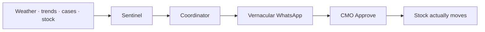

<div align="center">


# PULSE

**Predictive Unified Health Surge Engine**

PHC health intelligence for India — detect a surge, move surplus stock, alert the CMO.

[Live demo](https://pulse-web-ahao.onrender.com) · [Code for Community · Track 03](https://github.com/parthgoyal15/PULSE) · Smart Health & Supply Chain Resilience

</div>

A district should not find out about an ORS stock-out after patients are already turned away. PULSE scores outbreak risk, proposes a neighbouring-district transfer, drafts WhatsApp in **Marathi / Odia / Hindi**, and **moves mock stock when you click Approve**.

---

## 60 seconds on the live board

Open **[pulse-web-ahao.onrender.com](https://pulse-web-ahao.onrender.com)** (first load after idle can take ~1 minute).

| Step | What you see |
|---|---|
| 1 | Maharashtra → **Raigad 92 CRITICAL** — dengue + Iron / IV cover collapsing |
| 2 | **Transfers** → Nashik → Raigad. **If delayed 48h**, then **Approve** — KPIs and donor stock change |
| 3 | **CMO Copilot** — ask which transfer to approve first (grounded in live state, not a generic chatbot) |
| 4 | **Reports → Leakage** and **WhatsApp Demo**. Switch state for Odisha (Puri) or Rajasthan (Barmer) |

You do **not** need Simulate Outbreak. Gemini vs mock is labelled on every score.

---

## Why this is a supply-chain system, not a dashboard



Most health dashboards stop at a red number. PULSE closes the loop: **score → plan → message → decision → inventory**.

| Corridor | Crisis | Surplus | CMO language |
|---|---|---|---|
| Maharashtra | Raigad dengue | Nashik | Marathi |
| Odisha | Puri flood / diarrhea | Cuttack | Odia |
| Rajasthan | Barmer malaria / heat | Jodhpur | Hindi |

Intra-state first. Inter-state only if the destination state has no surplus district.

---

## AI — Google Gemini

Live Gemini on the hosted demo. Lite models first (`gemini-2.5-flash-lite`, `gemini-flash-lite-latest`), then `gemini-2.5-flash` / `gemini-3.8-flash`. If the key or quota fails, the UI says **MOCK** — it does not pretend Google ran.

| Gemini owns | What you can verify on screen |
|---|---|
| **Sentinel** | Risk score, days-to-surge, reasoning, recommended action |
| **Coordinator** | Transfer quantity, urgency, cost, one-line justification |
| **Reporter** | State-language WhatsApp + English block; weekly / monthly / post-incident briefs |
| **Copilot** | Answers using current risk, transfers, and PHC stock only |
| **48h delay** | Code computes which PHCs hit zero; Gemini writes the CMO brief |
| **Translate** | EN ↔ Hindi on Risk, Transfers, and Alerts |

Not Gemini: OpenStreetMap, leakage ratios (dispensed vs footfall), device read-aloud.

---

## Features

**Ops board** — National / state / district map · KPI strip · risk panel · transfer Approve / Modify / Escalate · 48h delay · alerts · Copilot · EN/हिं + speaker · Run Pipeline · Simulate Outbreak · autonomy bands (`<100` AUTO, `100–1000` APPROVE, `>1000` ESCALATE).

**Reports** — Weekly brief · monthly overview · post-incident · 2019 Raigad backtesting narrative · leakage audit / notify · WhatsApp phone mock.

**On Approve** — Donor PHCs (highest stock first) are drained; receiver PHCs (lowest stock first) are topped up. That is the demo’s proof of a real supply-chain action, not a toast message.

---

## Stack

| | |
|---|---|
| UI | Next.js, TypeScript, Leaflet |
| API | Python, Flask, SQLite |
| AI | Google Gemini (`google-genai`) |
| Signals | Open-Meteo rainfall, search-trend hints, IDSP-style demo counts |
| Host | Render — [dashboard](https://pulse-web-ahao.onrender.com) + API |

---

## Demo scope

Sample PHCs and IDSP-style counts are **illustrative**, not a live HMIS or MoHFW feed. Other states on the national map are markers only. Approve is explicit (no hidden auto-dispatch timer). Not affiliated with MoHFW, IDSP, or any state health department.

---

## Run locally

```bash
cd pulse/backend
python3 -m venv .venv && source .venv/bin/activate
pip install -r requirements.txt && cp .env.example .env   # optional GEMINI_API_KEY
python3 main.py                                           # :8000

cd pulse/frontend && npm install && npm run dev           # :3000
```
